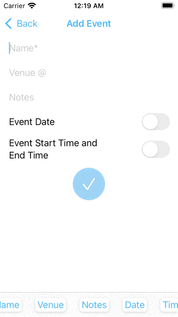

# EventUI
A Event App Developer into SwiftUI, App made to add Main Events and Unspecified Events on the basic of Event Name, This product is build to give into a interview machine Test Assignment to measure SwiftUI Knowledge

1. App which has All the details filtered into Main Events
2. App which has only Event Name filtered into Unspecified Events

# App Preview
<kbd>
 
</kbd>
&nbsp; &nbsp;
<kbd>
 
</kbd>
